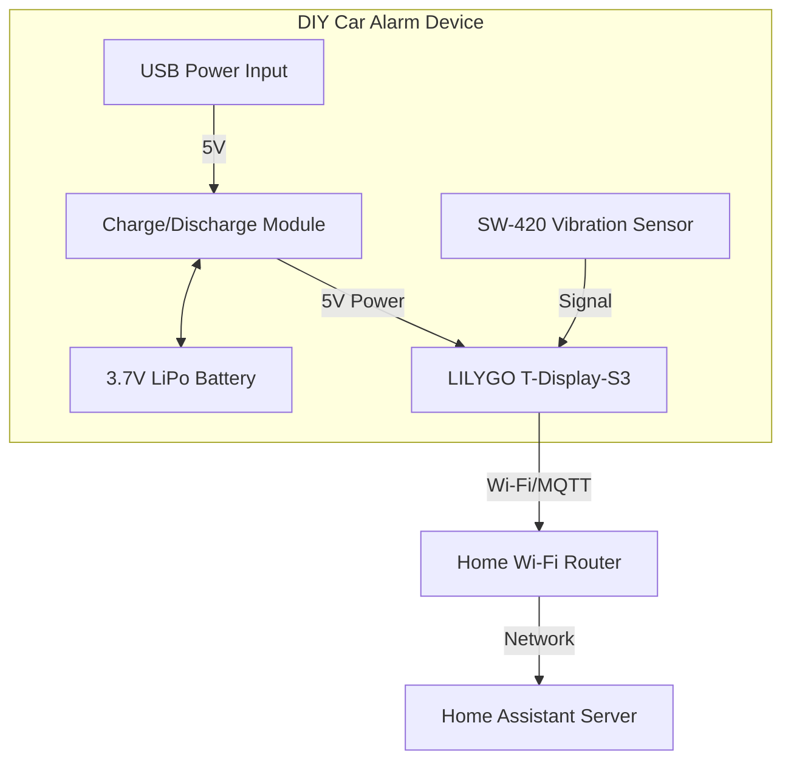

# DIY Vehicular Vibration Sensor Project

## Project Goal
Create a battery-operated device that detects vehicle movement/vibration and sends an alert over Wi-Fi to Home Assistant.

---

## Materials List
* **LILYGO T-Display-S3 (ESP32-S3)**: Main microcontroller and status display.
* **3.7V LiPo Battery (2000mAh/3000mAh)**: Portable power source.
* **2A 5V Charge/Discharge Module**: Battery management and 5V boost converter.
* **SW-420 Vibration Sensor**: Main alarm trigger sensor.

---

## Conceptual Design / Block Diagram



---

## Home Assistant Integration

1.  **Detection**: SW-420 triggers the ESP32.
2.  **Processing**: ESP32 wakes from deep sleep and sends an MQTT message.
3.  **HA Setup**: Define the entity as a `binary_sensor`.

### Home Assistant Automation

```yaml
alias: Car Alarm - Vibration Detected
description: Send an alert if vibration is detected when the alarm is armed.
mode: single

trigger:
  - platform: state
    entity_id: binary_sensor.car_alarm_vibration
    to: 'on'

condition:
  - condition: state
    entity_id: input_boolean.car_alarm_mode_armed
    state: 'on'

action:
  - service: notify.mobile_app_your_phone_name
    data:
      title: "ALERT!"
      message: "Potential break-in attempt detected in the car!"
      data:
        ttl: 0
        priority: high
```

---

## Technical Considerations

* **Deep Sleep**: Essential for battery longevity. Configure the SW-420 to act as an external wake-up interrupt for the ESP32.
* **Power Management**: Use the Charge/Discharge module to regulate voltage and allow for simple USB recharging.
